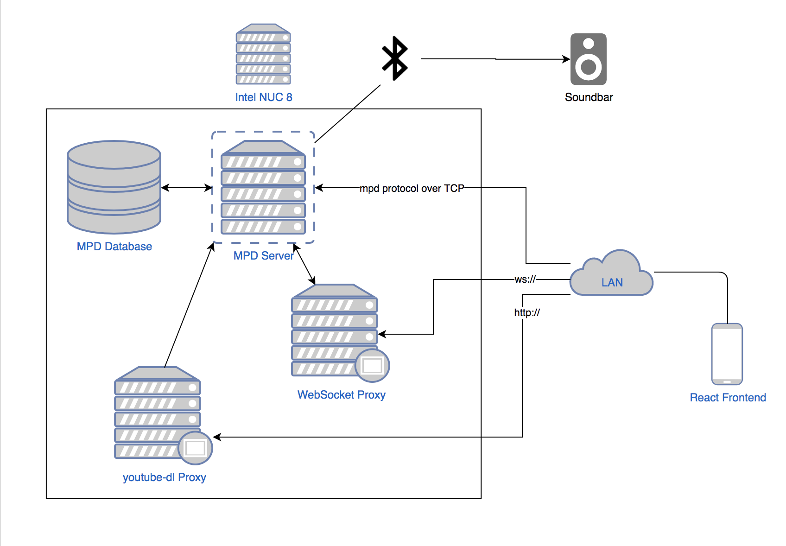

Thanks for checking out this repo. This is a personal project, the goal is to create a simple way to play music over my soundbar. Why did I start this project? Because I had guests over one time and someone complained I had no music. And now, $800 and dozens of hours later I am ready to prove them wrong.

Although this repo is hosted publically and theoretically anyone could fork/clone it, this client is closely coupled with all the proxies I have set up, so this is less a contribution to the open source community and more a show-and-tell for me.

# Network Diagram

# TODO
- [x] Set up box
  - [x] Soundbar connection with bluetooth
  - [x] Set up wifi with netplan
  - [x] Script to migrate music into directory tree based on id3 metadata
  - [ ] Clean up migrated music (discrepancies in letter casing, etc)
  - [ ] Album art
  - [ ] Harden security with iptables for eventual port forwarding over WAN
- [x] MPD
- [x] youtube-dl proxy
  - systemd service -> http -> youtube-dl -> mpc -> mpd
  - [x] Chrome extension to http post to the server
- [x] websocket proxy
  - systemd service -> mpd protocol -> localhost port 6600 <-> node.js WebSocket server port 6601 <-> client
- [x] Set up Apache to serve react frontend
- [-] React frontend (this repo)
  - [ ] Splash screen
  - [x] Promise-based MPD client
  - [-] Now playing view
  - [-] Youtube view
  - [-] Library view
  - [-] Bottom bar ("Shelf")
